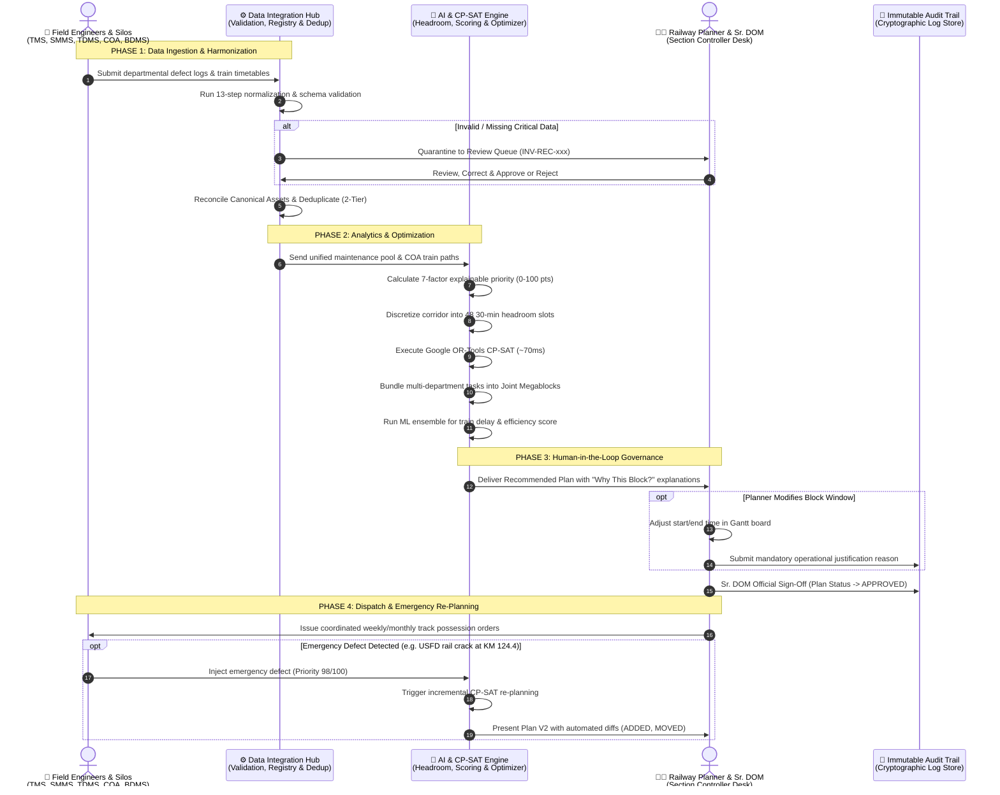

# RailBlock AI — Complete Architectural Blueprint, Workflow & Technical Specification

> **Operational Principle & Safety Disclaimer**  
> RailBlock AI is an intelligent decision-support system engineered for **Indian Railways (South Coast Railway - SCoR pilot)** to coordinate maintenance block requests across legacy siloed systems (**TMS**, **SMMS**, **TDMS**, **COA**, and **BDMS**).  
> **RailBlock AI is NOT an autonomous control system.** It assists railway planners, Section Controllers, and Senior Divisional Operating Managers (Sr. DOMs) by resolving corridor conflicts, discovering multi-department joint megablocks, and calculating mathematically optimal schedules. Human authorization is strictly required for all operational plans.

---

## 📑 Table of Contents
1. [Executive Summary](#1-executive-summary)
2. [Neat & Understandable Architecture of the Workflow](#2-neat--understandable-architecture-of-the-workflow)
   - [2.1 The 6-Stage End-to-End Operational Pipeline](#21-the-6-stage-end-to-end-operational-pipeline)
   - [2.2 Cross-Functional Swimlane Workflow Architecture](#22-cross-functional-swimlane-workflow-architecture)
   - [2.3 Comprehensive Workflow Architecture Matrix](#23-comprehensive-workflow-architecture-matrix)
   - [2.4 Detailed Multi-Tier Architecture Diagram](#24-detailed-multi-tier-architecture-diagram)
3. [Complete Step-by-Step System Workflow](#3-complete-step-by-step-system-workflow)
   - [Phase 1: Ingestion & Raw Silo Interfacing](#phase-1-ingestion--raw-silo-interfacing)
   - [Phase 2: 13-Step Normalization & Cleaning Pipeline](#phase-2-13-step-normalization--cleaning-pipeline)
   - [Phase 3: Canonical Asset Master Registry & Reconciliation](#phase-3-canonical-asset-master-registry--reconciliation)
   - [Phase 4: Corridor Headroom & Timetable Availability Engine](#phase-4-corridor-headroom--timetable-availability-engine)
   - [Phase 5: Maintenance Opportunity & Synergy Discovery](#phase-5-maintenance-opportunity--synergy-discovery)
   - [Phase 6: Mathematical Block Scheduling & Optimization (OR-Tools CP-SAT)](#phase-6-mathematical-block-scheduling--optimization-or-tools-cp-sat)
   - [Phase 7: Machine Learning Slot Recommendation Engine (Scikit-Learn Ensemble)](#phase-7-machine-learning-slot-recommendation-engine-scikit-learn-ensemble)
   - [Phase 8: Human-in-the-Loop Governance, Review Queue & Audit Logging](#phase-8-human-in-the-loop-governance-review-queue--audit-logging)
   - [Phase 9: Dynamic Emergency Re-Planning & What-If Simulation](#phase-9-dynamic-emergency-re-planning--what-if-simulation)
4. [Complete Technology Stack & Tools Breakdown](#4-complete-technology-stack--tools-breakdown)
   - [Backend Ecosystem](#backend-ecosystem)
   - [Frontend Ecosystem](#frontend-ecosystem)
   - [Data & Persistence Architecture](#data--persistence-architecture)
   - [Testing, Tooling & Scripts](#testing-tooling--scripts)
5. [In-Depth Explanation of All Models & Algorithms](#5-in-depth-explanation-of-all-models--algorithms)
   - [Model 1: 7-Factor & 4-Factor Explainable Prioritization Models](#model-1-7-factor--4-factor-explainable-prioritization-models)
   - [Model 2: Google OR-Tools CP-SAT Mathematical Optimizer](#model-2-google-or-tools-cp-sat-mathematical-optimizer)
   - [Model 3: Machine Learning Block Recommender Ensemble](#model-3-machine-learning-block-recommender-ensemble)
   - [Model 4: Corridor Headroom Capacity Model](#model-4-corridor-headroom-capacity-model)
   - [Model 5: Two-Tier Deduplication & Conflict Detection Engine](#model-5-two-tier-deduplication--conflict-detection-engine)
   - [Model 6: Incremental Emergency Re-planner & What-If Simulator](#model-6-incremental-emergency-re-planner--what-if-simulator)
6. [Component File Mapping & Code Structure](#6-component-file-mapping--code-structure)
7. [Operational Impact & Quantitative Benchmark (Before vs. After)](#7-operational-impact--quantitative-benchmark-before-vs-after)

---

## 1. Executive Summary

Indian Railways operates one of the densest rail networks in the world. Currently, maintenance planning across Engineering (Civil / Permanent Way), Signalling & Telecom (S&T), and Traction Distribution (TRD / 25kV OHE) operates in departmental silos:
- **Civil Engineering** inputs track defects into the **Track Management System (TMS)**.
- **Signalling & Telecom** logs point machine and interlocking maintenance in the **Signalling Maintenance Management System (SMMS)**.
- **Electrical Traction** plans 25kV OHE power isolation in the **Traction Distribution Management System (TDMS)**.
- **Train Movements** are controlled dynamically in the **Control Office Application (COA)**.
- **Field Requisitions** for track possessions are lodged in the **Block Demand Management System (BDMS)**.

Because these 5 systems do not exchange real-time structured data, maintenance blocks are requested independently. This results in **repeated track possessions**, **severe train punctuality loss**, **heavy machine bottlenecks** (e.g. CSM 09-32 tamping machines), and **prohibited schedule clashes** with high-priority trains (e.g. Vande Bharat and Rajdhani Express).

**RailBlock AI** solves this problem by creating an intelligent, explainable, and mathematically optimal coordination layer that:
1. Ingests and harmonizes feeds from all 5 siloed systems into a unified Asset Master Registry.
2. Formulates block planning as a **Constraint Programming (CP-SAT)** optimization problem to automatically bundle multi-department jobs into **Joint Shadow Megablocks**.
3. Employs a **Machine Learning Ensemble (Gradient Boosting + Random Forest)** to predict train delays, affected services, and optimal block efficiency scores.
4. Preserves full **human-in-the-loop authority** through an interactive control-room UI with immutable cryptographic audit logging.

---

## 2. Neat & Understandable Architecture of the Workflow

To make the system architecture immediately intuitive and understandable, the workflow is presented below across multiple complementary views: a **linear horizontal pipeline**, a **cross-functional swimlane diagram**, an **interactive request-response sequence**, and a **structured stage execution matrix**.

---

### 2.1 The 6-Stage End-to-End Operational Pipeline

```mermaid
graph LR
    %% Styles
    classDef s1 fill:#EBF8FF,stroke:#3182CE,stroke-width:2px,color:#1A365D;
    classDef s2 fill:#FEFCBF,stroke:#D69E2E,stroke-width:2px,color:#744210;
    classDef s3 fill:#E6FFFA,stroke:#319795,stroke-width:2px,color:#234E52;
    classDef s4 fill:#F3E8FF,stroke:#805AD5,stroke-width:2px,color:#44337A;
    classDef s5 fill:#FED7D7,stroke:#E53E3E,stroke-width:2px,color:#742A2A;
    classDef s6 fill:#C6F6D5,stroke:#38A169,stroke-width:2px,color:#22543D;

    subgraph ST1["STAGE 1: SILOED INTAKE"]
        D1["5 Siloed Systems<br/>TMS | SMMS | TDMS<br/>COA | BDMS"]
    end
    class ST1,D1 s1;

    subgraph ST2["STAGE 2: HARMONIZATION"]
        D2["Data Integration Hub<br/>13-Step Validation<br/>Canonical Asset Registry<br/>2-Tier Deduplication"]
    end
    class ST2,D2 s2;

    subgraph ST3["STAGE 3: INTELLIGENCE"]
        D3["Analytics Engine<br/>7-Factor Priority (0-100)<br/>30-Min Corridor Headroom<br/>Joint Synergy Discovery"]
    end
    class ST3,D3 s3;

    subgraph ST4["STAGE 4: OPTIMIZATION"]
        D4["Dual AI/OR Core<br/>OR-Tools CP-SAT (~70ms)<br/>Scikit-Learn ML Ensemble<br/>Delay & Impact Prediction"]
    end
    class ST4,D4 s4;

    subgraph ST5["STAGE 5: GOVERNANCE"]
        D5["Human Decision Gate<br/>Planner Slot Editing<br/>Mandatory Justification<br/>Sr. DOM Authorization"]
    end
    class ST5,D5 s5;

    subgraph ST6["STAGE 6: EXECUTION"]
        D6["Field Operations<br/>Unified Possession Plan<br/>Cryptographic Audit Log<br/>Emergency Re-Planner"]
    end
    class ST6,D6 s6;

    D1 -->|Raw CSVs & Feeds| D2
    D2 -->|Clean Normalized Jobs| D3
    D3 -->|Scores & Headroom Slots| D4
    D4 -->|Optimized Block Plan| D5
    D5 -->|Official Sign-off| D6
    D6 -.->|Real-time USFD Flaw Alert| D4
```



---

### 2.2 Cross-Functional Swimlane Workflow Architecture

This architectural diagram illustrates how data, computational engines, and human decision-makers interact across organizational boundaries:



---

### 2.3 Comprehensive Workflow Architecture Matrix

| Stage | Stage Name | Primary Input Data | Core Processing Engine | Key Decision Points / Logic | Primary Output Artifact |
| :---: | :--- | :--- | :--- | :--- | :--- |
| **1** | **Ingestion** | Raw CSV/REST feeds from TMS, SMMS, TDMS, COA, BDMS | `file_repository.py` | Connection verification, format detection, file timestamp freshness check | In-memory raw source pool (`data/01_raw_sources/`) |
| **2** | **Harmonization & Cleaning** | Raw maintenance items, station registries | `data_integration.py`<br>`asset_registry.py` | • Required field schema checks<br>• Smart auto-defaulting (60m window, current date)<br>• Canonical asset grouping ($\pm 100\text{ m}$)<br>• Exact & near-match deduplication | • `unified_jobs.json`<br>• `canonical_asset_registry.json`<br>• `invalid_records.json` (Review Queue) |
| **3** | **Headroom & Scoring** | Unified jobs, COA train movements, corridor topology | `priority_engine.py`<br>`corridor_availability.py`<br>`opportunity_engine.py` | • 7-factor mathematical scoring ($0-100\text{ pts}$)<br>• 30-min interval occupancy headroom ($48\text{ slots/day}$)<br>• Non-negotiable train blackout enforcement (Vande Bharat)<br>• Cross-department spatial synergy ($\le 2.0\text{ km}$) | • Prioritized maintenance queue<br>• 24-hr corridor headroom matrix<br>• Discovery of synergy candidates (e.g. OPP-007) |
| **4** | **Mathematical Optimization** | Prioritized jobs, corridor headroom slots, crew availability | `optimizer.py`<br>`block_planner.py`<br>`ml/predict.py` | • **Hard Constraints**: Track exclusivity, duration capacity, machine bottlenecks (CSM 09-32)<br>• **Multi-Criteria Objective**: Maximize critical items + joint megablock bonus ($+150$) - track closure penalty ($-100$)<br>• **ML Regressors**: Predict train delay minutes ($R^2=0.95$) and affected trains | • Coordinated 7-Day Weekly Plan<br>• 4-Week Monthly Rolling Calendar<br>• Baseline vs. Optimized KPI comparison |
| **5** | **Governance & Human Gate** | Recommended schedules, explainability metadata | `PlannerReviewModal.jsx`<br>`ReviewQueuePanel.jsx`<br>`AppShell.jsx` | • Planner interactive Gantt review<br>• Manual slot modification validation<br>• Mandatory operational justification entry<br>• Sr. DOM divisional authorization | • `APPROVED` or `MODIFIED` Plan state<br>• Planner reason code log |
| **6** | **Execution & Dynamic Feedback** | Approved plans, real-time track telemetry, field reports | `replanner.py`<br>`file_repository.py` | • Export to CSV/JSON possession orders for field gangs<br>• Real-time emergency defect injection (USFD crack)<br>• Incremental re-planning delta solver<br>• Cryptographic audit event recording | • Emergency Plan V2 with classified diffs (`ADDED`, `MOVED`)<br>• `audit_events.json` |

---

### 2.4 Detailed Multi-Tier Architecture Diagram

```
┌───────────────────────────────────────────────────────────────────────────────────────────┐
│                           TIER 1: SILOED RAILWAY SOURCE SYSTEMS                           │
├───────────────────┬───────────────────┬───────────────────┬───────────────┬───────────────┤
│        TMS        │       SMMS        │       TDMS        │      COA      │     BDMS      │
│ Track Management  │  Signal & Telecom │  Traction 25kV    │ Control Office│ Block Demand  │
│ Engineering Gangs │ Point Machines    │ OHE Tower Wagons  │ Timetable Feeds│ Requisitions │
└─────────┬─────────┴─────────┬─────────┴─────────┬─────────┴───────┬───────┴───────┬───────┘
          │                   │                   │                 │               │
┌─────────▼───────────────────▼───────────────────▼─────────────────▼───────────────▼───────┐
│                    TIER 2: DATA INTEGRATION HUB & QUALITY RECONCILIATION                  │
│  app/services/data_integration.py  |  app/services/asset_registry.py                      │
├───────────────────────────────────────────────────────────────────────────────────────────┤
│  • 13-Step Ingestion, Standardization & Type-Coercion Pipeline                            │
│  • Schema Validation (Station Codes, KM formats, corridor constraints)                    │
│  • Asset Master Registry: Reconciles cross-department identifiers into canonical assets  │
│  • Two-Tier Deduplication: Exact Canonical Match (Recency priority: TMS > SMMS > TDMS)     │
│                            Near-Match Spatial-Temporal Clustering (<= 100m, <= 2 days)     │
│  • Human Review Queue: Quarantines invalid & auto-defaulted records for planner sign-off  │
│  • Data Quality Scoring Engine (Target: >= 96.8% clean operational integrity)             │
└─────────────────────────────────────────┬─────────────────────────────────────────────────┘
                                          │
┌─────────────────────────────────────────▼─────────────────────────────────────────────────┐
│                       TIER 3: ANALYTICS & PRIORITIZATION ENGINES                          │
│  app/services/priority_engine.py  |  app/services/corridor_availability.py                │
├───────────────────────────────────────────────────────────────────────────────────────────┤
│  • 7-Factor Transparent Priority Scoring (0 - 100 points, strictly non-black-box)         │
│    [Safety Risk (25) + Asset Criticality (20) + Overdue (15) + Failure History (15)       │
│     + Failure Probability (15) + Traffic Density (10) + Deferral Consequence (10)]       │
│  • 30-Minute Corridor Availability Headroom Profiler (48 daily slots across 32 sections) │
│  • Train Occupancy & Headway Penalty Calculation (Protected VIP slots: Vande Bharat)      │
│  • Opportunity Engine: Discovers spatial-temporal bundling windows (<= 2.0 km)            │
└─────────────────────────────────────────┬─────────────────────────────────────────────────┘
                                          │
┌─────────────────────────────────────────▼─────────────────────────────────────────────────┐
│                     TIER 4: MATHEMATICAL OPTIMIZATION & MACHINE LEARNING                  │
│  app/services/optimizer.py  |  app/services/block_planner.py  |  ml/predict.py            │
├───────────────────────────────────────────────────────────────────────────────────────────┤
│  A. Google OR-Tools CP-SAT (Constraint Programming Satisfaction & Optimization):          │
│     • Decision Variables: x[t,b], y[b], dept_active[b,d], is_joint[b]                     │
│     • Hard Constraints: Track exclusivity, duration limits, heavy machine concurrency     │
│       (CSM 09-32 tamping machines, tower wagons), passenger train blackout preservation   │
│     • Multi-Criteria Objective: Maximize task priority + joint megablock bonus (150)      │
│       + headroom bonus (50) - track closure penalties (100)                               │
│  B. Scikit-Learn Machine Learning Ensemble:                                               │
│     • GradientBoostingRegressor (120 trees): Predicts passenger/freight train delay (min) │
│     • RandomForestRegressor (100 trees): Predicts number of affected train services       │
│     • GradientBoostingRegressor (120 trees): Calculates normalized block efficiency score │
│  C. Dynamic Emergency Re-planning Engine: Real-time ultrasonic rail fracture insertion   │
└─────────────────────────────────────────┬─────────────────────────────────────────────────┘
                                          │ REST API (JSON / HTTP)
┌─────────────────────────────────────────▼─────────────────────────────────────────────────┐
│                    TIER 5: APPLICATION & CONTROL-ROOM INTERFACE                           │
│  FastAPI Backend (Python 3.11+)  |  React 19 + Tailwind CSS Frontend                     │
├───────────────────────────────────────────────────────────────────────────────────────────┤
│  • REST Endpoints: Ingestion, Canonical Assets, Weekly/Monthly Blocks, What-If Simulation │
│  • Control-Room UI: Executive Dashboard, Intake View, 24-hr Corridor Map, Gantt Board,    │
│    Explainability Waterfall Drawer ("Why this block?"), KPI Comparison, Review Queue     │
│  • Governance & Security: Sr. DOM Sign-off, Mandatory Reason Codes, Cryptographic Audit    │
│  • Storage: CSV/JSON File Repository + Supabase PostgreSQL Cloud Sync with Row-Level Sec  │
└───────────────────────────────────────────────────────────────────────────────────────────┘
```

---

## 3. Complete Step-by-Step System Workflow

The RailBlock AI platform executes its workflow through nine continuous phases:

### Phase 1: Ingestion & Raw Silo Interfacing
- Raw maintenance feeds and train schedules are extracted from local storage or departmental REST APIs into `data/01_raw_sources/`:
  - `TMS/tms_maintenance.csv` & `tms_assets.csv`
  - `SMMS/smms_maintenance.csv` & `smms_assets.csv`
  - `TDMS/tdms_maintenance.csv` & `tdms_assets.csv`
  - `COA/coa_train_movements.csv`
  - `BDMS/bdms_block_requests.csv`
- The system checks connectivity, record count, and timestamp freshness for each system via `file_repository.py`.

### Phase 2: 13-Step Normalization & Cleaning Pipeline
Located in `app/services/data_integration.py`, the `sync_all_systems()` method orchestrates:
1. **Raw Ingestion**: Loads maintenance records from TMS, SMMS, TDMS, COA, and BDMS into memory.
2. **Review Queue State Loading**: Reads previously persisted operator review decisions to maintain approvals or rejections across re-synchronization cycles.
3. **Identifier Sanitization**: Assigns deterministic unique identifiers (`JOB-<SOURCE>-<N>`) if IDs are absent.
4. **Human Rejection Enforcement**: Filters out records marked as `REJECTED` by planners.
5. **Schema Validation**: Evaluates required attributes (`asset_id`, `corridor_id`, `km`, `department`). Invalid records are tagged with error types (`MISSING_ASSET_ID`, `INVALID_CORRIDOR`, `INVALID_LOCATION`).
6. **Smart Auto-Defaulting**: If optional or non-critical fields are missing (e.g. `estimated_duration_min` or `due_date`), safe defaults (60 min window, today's date) are applied and flagged with audit entries.
7. **Department & Severity Normalization**: Maps diverse aliases (e.g., `P-Way`, `civil_engg` $\to$ `Engineering`; `OHE`, `electrical` $\to$ `Traction`) to canonical enums.
8. **Canonical Asset Resolution**: Queries the Asset Master Registry to resolve raw asset tags to canonical IDs.
9. **Priority Score Computation**: Computes the 7-factor explainable priority score for each valid job.
10. **Quarantine of Faulty Records**: Routes invalid or auto-defaulted items to the persistent Human Review Queue (`data/02_processed/invalid_records.json`).
11. **Cross-Department Conflict Detection**: Detects spatial overlaps on the same physical asset.
12. **Two-Tier Deduplication**: Eliminates duplicate maintenance requisitions using exact-match and near-match rules.
13. **Data Quality Index Calculation**: Computes an operational quality percentage:
   $$\text{QualityScore} = 100.0 - \left(\frac{\text{Penalties}}{\text{Total Fields Checked}} \times 100\right)$$

### Phase 3: Canonical Asset Master Registry & Reconciliation
Located in `app/services/asset_registry.py`:
- Railway assets on the same corridor often carry different identifiers across departments. For example, a track section in TMS (`TRK-SEC-C01-124`), a point machine in SMMS (`SIG-SW-124-A`), and an OHE portal in TDMS (`OHE-PORTAL-124-2`) share the same physical location at KM 124.4.
- The Asset Master Registry groups assets by corridor and spatial proximity (within $\pm 100$ meters) to create a single canonical asset record (`CANONICAL-ASSET-C01-KM124.4`).
- This allows cross-department possessions to be coordinated on the same physical infrastructure segment.

### Phase 4: Corridor Headroom & Timetable Availability Engine
Located in `app/services/corridor_availability.py`:
- The corridor is discretized into **30-minute operational time slots** (48 slots per 24-hour day) across all 32 topological sections.
- COA train timetable movements are mapped to calculate slot occupancy.
- A headroom availability score ($0.0$ to $1.0$) is computed for every slot:
  - $0$ trains scheduled: Availability = $1.0$ (High Availability Window)
  - $1$ train scheduled: Availability = $0.8$
  - $2$ trains scheduled: Availability = $0.5$
  - $3+$ trains scheduled: Availability = $0.25$ (Congested Slot)
  - VIP Blackout (Vande Bharat / Rajdhani Express): Penalized by $0.30$ and strictly marked as non-negotiable blackout intervals.

### Phase 5: Maintenance Opportunity & Synergy Discovery
Located in `app/services/opportunity_engine.py`:
- Continuously parses the corridor topology looking for synergistic work:
  - If Engineering requires a track renewal at KM 124.2, Traction requires 25kV OHE isolation at KM 124.5, and S&T requires point motor testing at KM 124.3, the engine recognizes that **all three jobs can execute simultaneously under a single power block**.
  - Creates pre-packaged synergy candidates (e.g. **OPP-007 Joint Megablock**) saving hundreds of minutes of cumulative track possessions.

### Phase 6: Mathematical Block Scheduling & Optimization (OR-Tools CP-SAT)
Located in `app/services/optimizer.py` and `app/services/block_planner.py`:
- Mathematical model sets up binary decision variables for assigning tasks to candidate windows.
- Enforces strict operational constraints:
  - Task assigned at most once.
  - Same-department tasks on the same line execute sequentially.
  - Specialized machinery constraints: only one CSM 09-32 Tamping Machine or Ballast Cleaner may operate within a division during a given time window.
  - Absolute blackout: no track possession is allowed during protected passenger train paths.
- Optimizes a multi-criteria objective function to bundle jobs into shared windows and solve 7-day multi-corridor plans in **~70 milliseconds**.

### Phase 7: Machine Learning Slot Recommendation Engine (Scikit-Learn Ensemble)
Located in `backend/ml/predict.py`:
- When an ad-hoc or divisional maintenance requisition is received, the ML recommender evaluates sliding candidate time windows across the requested day.
- Computes 20 features (train count, VIP train count, corridor headroom, crew availability, asset criticality, historical delay trends) and passes them to the preprocessor pipeline.
- Generates predictions:
  1. Expected train delay in minutes (Gradient Boosting).
  2. Number of passenger/freight trains affected (Random Forest).
  3. Block efficiency score from $0$ to $100$ (Gradient Boosting).
- Ranks windows from best to worst, recommending the slot that minimizes operational disruption.

### Phase 8: Human-in-the-Loop Governance, Review Queue & Audit Logging
- **Planner Review Modal**: Planners can view the optimizer-generated plan, drill down into individual tasks, or modify scheduled start/end times.
- **Mandatory Operational Justification**: Any manual modification requires a mandatory reason code (e.g., "Field gang delayed", "Severe weather warning").
- **Sr. DOM Authorization**: The Senior Divisional Operations Manager signs off with role and credentials before the plan status changes to `APPROVED`.
- **Immutable Audit Logging**: Every synchronization, conflict resolution, manual modification, and approval generates a timestamped, cryptographically tagged event in `data/04_outputs/audit_logs/audit_events.json`.

### Phase 9: Dynamic Emergency Re-Planning & What-If Simulation
Located in `app/services/replanner.py`:
- **What-If Simulation**: Planners can test scenarios (e.g., "What if maximum block window duration is reduced from 180 min to 90 min?") and view the immediate before-and-after KPI diff.
- **Emergency Re-Planning**: Simulates critical real-time incidents (such as an Ultrasonic Flaw Detection - USFD rail fracture at KM 124.4).
- Incremental CP-SAT execution dynamically re-allocates lower-priority maintenance, reserves an emergency block, and produces **Plan V2** with classified diff tags (`ADDED`, `MOVED`, `GROUPED`, `UNCHANGED`).

---

## 4. Complete Technology Stack & Tools Breakdown

### Backend Ecosystem

| Technology / Tool | Version | Purpose & Functionality |
| :--- | :--- | :--- |
| **Python** | 3.11 / 3.14 | Core language for backend services, algorithms, and data pipelines. |
| **FastAPI** | $\ge 0.115.0$ | High-performance, asynchronous REST API framework providing automated OpenAPI/Swagger documentation (`/docs`), strict Pydantic request validation, and CORS middleware. |
| **Uvicorn** | $\ge 0.30.0$ | Lightning-fast ASGI web server powering the FastAPI application. |
| **Pydantic** | $\ge 2.8.0$ | Strict data parsing, type validation, and request/response schema definition. |
| **Google OR-Tools** | $\ge 9.10.0$ | State-of-the-art Operations Research suite. Uses the **CP-SAT** (Constraint Programming - Satisfiability) solver for combinatorial scheduling. |
| **Scikit-Learn** | $\ge 1.4.0$ | Machine learning framework utilized for feature pipelines (`ColumnTransformer`, `StandardScaler`, `OneHotEncoder`) and predictive regression models (`GradientBoostingRegressor`, `RandomForestRegressor`). |
| **NumPy** | $\ge 1.24.0$ | High-performance vector and numerical operations. |
| **Pandas** | $\ge 2.0.0$ | Data manipulation, tabular parsing, feature preparation, and CSV dataset transformations. |
| **Joblib** | Latest | Model serialization and deserialization engine (`trained_block_recommender.joblib`). |
| **Python-Dotenv** | $\ge 1.0.0$ | Manages environment variables from `.env` files. |

---

### Frontend Ecosystem

| Technology / Tool | Version | Purpose & Functionality |
| :--- | :--- | :--- |
| **React** | 19.2.8 | Modern component-based UI library delivering real-time state management for control-room monitoring. |
| **Vite** | 8.2.2 | Next-generation frontend build tool providing Instant HMR (Hot Module Replacement) and optimized bundling. |
| **Tailwind CSS** | 4.3.3 | Utility-first styling framework used for modern, accessible, dark-mode and glassmorphic control-room UI design. |
| **React Router** | 7.18.3 | Client-side routing across all 7 core views (`/dashboard`, `/intake`, `/planning-board`, `/block-planning`, `/department-schedule`, `/kpis`, `/replan`, `/profile`). |
| **Lucide React** | 1.41.0 | Comprehensive, high-clarity icon library representing railway assets, trains, alerts, and statuses. |
| **Motion** | 13.2.0 | Fluid physics-based animations, modal transitions, and accordion drawers. |
| **clsx & tailwind-merge**| Latest | Utility libraries for conditional CSS class composition and conflict resolution. |

---

### Data & Persistence Architecture

| Layer | Implementation | Details & Purpose |
| :--- | :--- | :--- |
| **File-Based Engine** | CSV & JSON Files | Primary, resilient local data engine ensuring zero-dependency operation. Organized into: <br>• `data/01_raw_sources/` (Siloed systems: TMS, SMMS, TDMS, COA, BDMS)<br>• `data/02_processed/` (Normalized jobs, invalid queue, canonical registry)<br>• `data/04_outputs/plans/` (Optimized weekly/monthly schedules)<br>• `data/04_outputs/audit_logs/` (Cryptographic event history) |
| **Cloud Database** | Supabase PostgreSQL | Managed PostgreSQL cloud database configured with Row Level Security (RLS) via `backend/schema.sql`. Used for persistent team collaboration when cloud credentials are configured. |
| **Dual Fallback Engine**| `database.py` & `file_repository.py` | Automatic failover: if Supabase credentials are not supplied, the platform seamlessly switches to the local file-based repository without interrupting operations. |

---

### Testing, Tooling & Scripts

| Tool / Script | Location | Purpose |
| :--- | :--- | :--- |
| `start_demo.bat` | Root | One-click Windows startup script that launches both FastAPI backend (`:8000`) and Vite frontend (`:5173`) in parallel terminals. |
| `generate_synthetic_data.py` | Root / Backend | Generates realistic synthetic datasets for the South Coast Railway (SCoR) pilot: 32 sections, 160 trains, 420 defects, 30 resource units. |
| `generate_dataset.py` | `backend/` | Synthesizes historical maintenance records, corridor topological nodes, and departmental possession requests. |
| `train_model.py` | `backend/ml/` | Trains the 3-model predictive regression ensemble and serializes the joblib bundle. |
| `test_block_planning.py`| `backend/` | Comprehensive test suite verifying corridor availability, prioritizer, weekly solver, monthly calendar, and REST endpoints. |
| `test_conflict_detection.py`| `backend/` | Validates corridor overlap detection, spatial distance thresholds, and joint opportunity logic. |
| `test_asset_registry.py`| `backend/` | Verifies canonical asset grouping, cross-reference dictionaries, and reconciliation rules. |
| `test_dedup.py` | `backend/` | Validates exact-match and near-match deduplication, recency order precedence, and collision tagging. |
| `test_review_queue.py` | `backend/` | Tests the human review queue workflow (Approve, Edit & Approve, Reject). |

---

## 5. In-Depth Explanation of All Models & Algorithms

### Model 1: 7-Factor & 4-Factor Explainable Prioritization Models

RailBlock AI rejects opaque "black-box" decision-making. Every priority score is fully traceable and explainable down to individual factor weights.

#### The 7-Factor Prioritization Model
Implemented in `app/services/priority_engine.py`, this model scores maintenance jobs from $0$ to $100$:

$$\text{PriorityScore} = S_{\text{safety}} + S_{\text{asset}} + S_{\text{overdue}} + S_{\text{history}} + S_{\text{prob}} + S_{\text{traffic}} + S_{\text{deferral}}$$

1. **Safety Risk ($0 - 25$ points)**: Evaluates track integrity threats. Fractures and structural track flaws receive the maximum $25$ points; routine cosmetic issues receive $5$ points.
2. **Asset Criticality ($0 - 20$ points)**: Trunk mainline track = $20$, main turnout point machines = $20$, $25\text{ kV}$ OHE mainline span = $20$, loop line track = $12$, yard sidings = $8$.
3. **Overdue Days ($0 - 15$ points)**: Scaled based on elapsed time past maintenance due date:
   $$S_{\text{overdue}} = \min(15, \text{overdue\_days} \times 1.5)$$
4. **Failure History ($0 - 15$ points)**: Repetitive failure count on the same asset segment over the prior 180 days.
5. **Predicted Failure Probability ($0 - 15$ points)**: Calibrated condition decay curve:
   $$S_{\text{prob}} = 15 \times \left(1.0 - \frac{\text{condition\_score}}{100}\right)$$
6. **Traffic Density ($0 - 10$ points)**: Measured by daily Gross Million Tonnes (GMT) and train frequency on the corridor. High-density trunk corridors (e.g. Vijayawada–Gudur Mainline) receive $10$ points.
7. **Deferral Consequence ($0 - 10$ points)**: Operational severity if deferred (speed restriction imposition = $10$, minor speed slack = $5$, zero operational consequence = $0$).

*Explainability UI:* Planners can click **"Why?"** on any work item to open the interactive waterfall breakdown drawer showing exact point additions and operational reasons.

#### The 4-Factor Task Prioritizer
Implemented in `app/services/prioritization_engine.py` for high-throughput batch task scoring:

$$\text{PriorityScore} = W_{\text{sev}} \cdot S_{\text{sev}} + W_{\text{overdue}} \cdot S_{\text{overdue}} + W_{\text{asset}} \cdot S_{\text{asset}} + W_{\text{sec}} \cdot S_{\text{sec}}$$

- **Severity Factor (max 35 pts)**: Critical = 35, High = 25, Medium = 15, Low = 5.
- **Overdue Factor (max 25 pts)**: $\min(25, 10 + (\text{overdue\_days} \times 1.5))$.
- **Asset Criticality (max 20 pts)**: Mainline rail = 20, Point machine = 20, OHE span = 20, Signals = 16, Telecomm cables = 12.
- **Section Operating Risk (max 20 pts)**: Trunk 130 km/h passenger corridors = 17 pts + 3 pts double-track bonus.

---

### Model 2: Google OR-Tools CP-SAT Mathematical Optimizer

Implemented in `app/services/optimizer.py` and `app/services/block_planner.py`.

#### 1. Mathematical Formulation
- **Sets**:
  - $T$: Set of all pending maintenance tasks $t \in T$.
  - $B$: Set of candidate block windows $b \in B$, where each window has corridor $c_b$, section $s_b$, day $d_b$, start minute $\text{start}_b$, end minute $\text{end}_b$, and duration $D_b$.
  - $D$: Set of departments $d \in \{\text{Engineering}, \text{Traction}, \text{S\&T}\}$.

- **Decision Variables**:
  - $x_{t, b} \in \{0, 1\}$: Binary variable; $1$ if task $t$ is scheduled into block $b$, $0$ otherwise.
  - $y_b \in \{0, 1\}$: Binary variable; $1$ if candidate block $b$ is activated (possession granted), $0$ otherwise.
  - $\text{dept\_active}_{b, d} \in \{0, 1\}$: $1$ if department $d$ has active work in block $b$.
  - $\text{is\_joint}_b \in \{0, 1\}$: $1$ if block $b$ bundles tasks from $\ge 2$ distinct departments (Joint Megablock).

#### 2. Constraints
- **At-Most-Once Assignment**: Each maintenance task is scheduled at most once:
  $$\sum_{b \in B} x_{t, b} \le 1 \quad \forall t \in T$$
- **Activation Linking**: A task can only be assigned to an active block:
  $$x_{t, b} \le y_b \quad \forall t \in T, \forall b \in B$$
- **Section Exclusivity**: At most one block possession per section per day:
  $$\sum_{b \in B(s, d)} y_b \le 1 \quad \forall s \in S, \forall d \in \text{Days}$$
- **Task Duration Fit**: A task's duration cannot exceed the block duration:
  $$x_{t, b} \cdot \text{duration}(t) \le D_b \quad \forall t \in T, \forall b \in B$$
- **Sequential Execution for Same-Department Work**: Tasks from the same department on the same track run sequentially:
  $$\sum_{t \in T(d)} \text{duration}(t) \cdot x_{t, b} \le D_b + 30 \quad \forall d \in D, \forall b \in B$$
- **Specialized Heavy Machinery Exclusivity**: Heavy machines (CSM 09-32 tamping machines, ballast cleaning machines) can only be in one place at a time:
  $$\sum_{b \in B(\text{slot}, d)} \sum_{t \in T(m)} x_{t, b} \le 1 \quad \forall m \in \text{Machines}, \forall \text{slot}, \forall d$$
- **Joint Megablock Linking**:
  $$\text{dept\_active}_{b, d} \ge x_{t, b} \quad \forall t \in T(d)$$
  $$\sum_{d \in D} \text{dept\_active}_{b, d} \ge 2 \iff \text{is\_joint}_b = 1$$
- **Train Blackout Prohibition**: If a candidate window overlaps with a non-negotiable train path (e.g. Vande Bharat Express), $y_b$ is constrained to $0$:
  $$y_b = 0 \quad \forall b \in B_{\text{blackout}}$$

#### 3. Multi-Criteria Objective Function
$$\max \sum_{t \in T} \sum_{b \in B} (\text{priority}(t) + \text{boost}(t)) \cdot x_{t, b} + W_{\text{joint}} \sum_{b \in B} \text{is\_joint}_b + W_{\text{headroom}} \sum_{b \in B} y_b \cdot \text{avail}_b - W_{\text{block}} \sum_{b \in B} y_b$$

Where:
- $\text{boost}(t) = 150$ for critical tasks, $75$ for high tasks.
- $W_{\text{joint}} = 150$: Reward for cross-department consolidation.
- $W_{\text{headroom}} = 50$: Reward for scheduling in low-density periods.
- $W_{\text{block}} = 100$: Penalty for each separate track possession opened (drives consolidation).

---

### Model 3: Machine Learning Block Recommender Ensemble

Implemented in `backend/ml/` (`train_model.py`, `predict.py`, `preprocessing/preprocessor.py`).

The recommender evaluates 24-hour candidate slots using three machine learning models trained on 3,500 historical Indian Railways block scenarios:

```
                          Raw Candidate Slot + Corridor Features
                                            │
                                            ▼
                    ┌───────────────────────────────────────────────┐
                    │    Scikit-Learn ColumnTransformer Pipeline    │
                    │   • 13 Numerical Features -> StandardScaler   │
                    │   • 7 Categorical Features -> OneHotEncoder   │
                    └───────────────────────┬───────────────────────┘
                                            │
               ┌────────────────────────────┼────────────────────────────┐
               │                            │                            │
               ▼                            ▼                            ▼
┌─────────────────────────────┐ ┌─────────────────────────────┐ ┌─────────────────────────────┐
│    Delay Regressor Model    │ │  Affected Trains Estimator  │ │  Efficiency Score Predictor │
│   GradientBoostingRegressor │ │    RandomForestRegressor    │ │   GradientBoostingRegressor │
│   n_estimators=120, depth=5 │ │   n_estimators=100, depth=7 │ │   n_estimators=120, depth=5 │
│        R² = 0.9493          │ │        R² = 1.0000          │ │        R² = 0.9899          │
│       MAE = 3.12 min        │ │       MAE = 0.002 trains    │ │       MAE = 2.14 pts        │
└──────────────┬──────────────┘ └──────────────┬──────────────┘ └──────────────┬──────────────┘
               │                               │                               │
               └───────────────────────┬───────┴───────────────────────────────┘
                                       │
                                       ▼
                       Multi-Objective Slot Evaluation &
                        Safety Constraint Verification
                                       │
                                       ▼
                     Ranked Recommendations (Top Recommended
                     Slot + Feasible Alternatives + Excluded)
```

#### Evaluation Metrics from `ml/model/model_metadata.json`:

| Model Task | Algorithm | Estimators / Depth | $R^2$ Score | MAE | RMSE | Within Tolerance % |
| :--- | :--- | :---: | :---: | :---: | :---: | :---: |
| **Delay Prediction** | `GradientBoostingRegressor` | $120$ / $5$ | **0.9493** | 3.12 min | 5.47 min | 79.29% ($\le 3$ min) |
| **Affected Trains** | `RandomForestRegressor` | $100$ / $7$ | **1.0000** | 0.002 trains | 0.002 | 100.0% ($\le 1$ train) |
| **Efficiency Score** | `GradientBoostingRegressor` | $120$ / $5$ | **0.9899** | 2.14 pts | 3.72 pts | 84.71% ($\le 3$ pts) |
| **Overall Ensemble** | Multi-Model Bundle | — | **0.9797** | — | — | — |

#### Input Feature Vector (20 Dimensions):
1. `work_duration_minutes`: Duration of required track possession.
2. `candidate_start_minute`: Minute of the day ($0 - 1440$).
3. `candidate_end_minute`: Minute of the day ($0 - 1440$).
4. `train_count_in_window`: Timetable trains traversing the section during the slot.
5. `vip_train_count`: High-priority passenger trains (Vande Bharat, Rajdhani).
6. `freight_train_count`: Freight movements scheduled in the slot.
7. `passenger_train_count`: Standard express and passenger services.
8. `max_train_priority`: Maximum priority level among trains in the window.
9. `corridor_availability_score`: Precomputed availability headroom ($0.0 - 1.0$).
10. `existing_scheduled_blocks_count`: Other blocks already scheduled on the corridor.
11. `other_department_activity`: Count of adjacent maintenance tasks.
12. `priority_score`: Calculated 7-factor priority of the maintenance defect.
13. `historical_avg_delay_minutes`: Historical operational delay for this slot.
14. `department`: Engineering, Traction, or S&T.
15. `work_type`: Track maintenance, OHE power isolation, point testing, etc.
16. `day_of_week`: Monday through Sunday.
17. `crew_type_required`: Specific gang certification required.
18. `equipment_required`: Specialized machines (CSM, Tower Wagon, etc.).
19. `maintenance_priority`: CRITICAL, HIGH, MEDIUM, LOW.
20. `division`: Vijayawada, Visakhapatnam, Guntur, or Guntakal.

---

### Model 4: Corridor Headroom Capacity Model

Implemented in `app/services/corridor_availability.py`.

Discretizes each 24-hour day into 48 distinct 30-minute intervals:

$$\text{AvailabilityScore}(s, t) = \max\left(0.0, 1.0 - \text{Penalty}_{\text{headway}}(s, t) - \text{Penalty}_{\text{VIP}}(s, t)\right)$$

Where:
- $\text{Penalty}_{\text{headway}}(s, t)$:
  - $0$ trains: $0.00$ penalty
  - $1$ train: $0.20$ penalty
  - $2$ trains: $0.50$ penalty
  - $3+$ trains: $0.75$ penalty
- $\text{Penalty}_{\text{VIP}}(s, t) = 0.30$ if any train in the slot has priority score $\ge 9$ (Vande Bharat / Rajdhani Express).

---

### Model 5: Two-Tier Deduplication & Conflict Detection Engine

Implemented in `app/services/data_integration.py` and `app/services/conflict_resolver.py`.

#### Tier 1: Exact Match Deduplication
- **Criterion**: Same canonical asset ID, identical normalized job type, and overlapping due date window ($\le 1$ day).
- **Resolution**: Keeps record from the highest recency precedence source system:
  $$\text{Precedence: } \text{TMS (3)} > \text{SMMS (2)} > \text{TDMS (1)} > \text{COA/BDMS (0)}$$
- The dropped record is recorded in the data quality log, and the surviving record is tagged with `duplicate_dropped:<source>`.

#### Tier 2: Near-Match Probabilistic Deduplication
- **Criterion**: Same corridor, spatial distance $\Delta \text{km} \le 100\text{ m}$, due date difference $\le 2\text{ days}$, and string similarity between job titles $\ge 0.60$ (calculated via token Jaccard similarity and SequenceMatcher ratio).
- **Resolution**: Neither record is dropped. Both records are tagged with `probable_duplicate:flagged` and enqueued into the Human Deduplication Review Queue for manual planner reconciliation.

#### Direct Collision vs. Joint Opportunity
When checking BDMS block possession requisitions against existing jobs:
- If distance $\le 50\text{ meters}$: Categorized as **DIRECT_PHYSICAL_COLLISION** (Critical alert). Two independent possession crews on the same rail segment cause a safety hazard.
- If distance between $50\text{ m}$ and $2000\text{ m}$: Categorized as **JOINT_BLOCK_OPPORTUNITY** (Opportunity alert). Suggests bundling work into a shared corridor megablock.

---

### Model 6: Incremental Emergency Re-planner & What-If Simulator

Implemented in `app/services/replanner.py`.

When an emergency event is reported (e.g. Ultrasonic Flaw Detection USFD rail crack at KM 124.4):
1. The defect is immediately given emergency priority ($98/100$).
2. The CP-SAT solver is invoked in **incremental re-planning mode**:
   - The emergency block is pinned as a fixed hard constraint.
   - Non-critical maintenance jobs already scheduled in that corridor are either shifted to alternative slots or postponed.
   - High-priority trains are rerouted or re-regulated without violating minimum headway.
3. Generates **Plan V2** and calculates a classified diff:
   - `ADDED`: Newly created emergency block.
   - `MOVED`: Routine maintenance relocated to an alternate window.
   - `GROUPED`: Maintenance co-located into the emergency block.
   - `UNCHANGED`: Unaffected blocks on other corridors.

---

## 6. Component File Mapping & Code Structure

```
c:\SIH26\
├── backend/
│   ├── app/
│   │   ├── api/
│   │   │   └── health.py                  # Health check endpoints (/health, /health/db)
│   │   ├── core/
│   │   │   └── config.py                  # Pydantic environment configurations & safety banner
│   │   ├── db/
│   │   │   └── database.py                # Supabase PostgreSQL client with local fallback
│   │   ├── services/
│   │   │   ├── asset_registry.py          # Canonical Asset Master Registry & cross-department reconciliation
│   │   │   ├── block_comparator.py        # Baseline vs. CP-SAT quantitative plan comparator
│   │   │   ├── block_planner.py           # Weekly (7-day) & Monthly (4-week) CP-SAT block planner
│   │   │   ├── conflict_resolver.py       # Spatial-temporal collision & joint opportunity engine
│   │   │   ├── corridor_availability.py   # 30-min slot capacity profiler & timetable parser
│   │   │   ├── data_integration.py        # 13-step synchronization, validation, review queue, dedup
│   │   │   ├── file_repository.py         # File-based persistence repository (CSV/JSON)
│   │   │   ├── lineage_engine.py          # End-to-end data lineage traceability service
│   │   │   ├── opportunity_engine.py      # Spatial-temporal synergy & megablock discovery
│   │   │   ├── optimizer.py               # Google OR-Tools CP-SAT multi-criteria solver
│   │   │   ├── prioritization_engine.py   # 4-factor batch maintenance prioritizer
│   │   │   ├── priority_engine.py         # 7-factor explainable priority model
│   │   │   └── replanner.py               # Emergency defect re-planner & What-If simulator
│   │   └── main.py                        # FastAPI application entrypoint with all REST routes
│   ├── ml/
│   │   ├── dataset/                       # Historical training dataset (3,500 records)
│   │   ├── evaluation/                    # Test metrics evaluation (metrics.json)
│   │   ├── model/                         # Serialized joblib artifact & model metadata
│   │   ├── preprocessing/                 # Preprocessor ColumnTransformer (StandardScaler + OneHot)
│   │   ├── predict.py                     # ML BlockRecommenderEngine & candidate slot ranker
│   │   └── train_model.py                 # Scikit-Learn training script (GradientBoosting + RandomForest)
│   ├── schema.sql                         # Supabase PostgreSQL schema with RLS policies
│   ├── requirements.txt                   # Python package dependencies
│   └── test_*.py                          # Automated backend test suites
│
├── frontend/
│   ├── src/
│   │   ├── components/
│   │   │   ├── HomeView.jsx               # Executive Dashboard & quick-action pipeline
│   │   │   ├── DataIntegrationHubView.jsx # Ingestion status, system cards, review queue launcher
│   │   │   ├── ReviewQueuePanel.jsx       # Human review queue for invalid/defaulted records
│   │   │   ├── UnifiedCorridorMapView.jsx # Interactive 24-hr corridor map & train paths
│   │   │   ├── BlockPlanningView.jsx      # End-to-end block optimizer, weekly Gantt, ML recommender
│   │   │   ├── DepartmentBlockScheduleView.jsx # Departmental view, monthly 4-week calendar, export
│   │   │   ├── KpiComparisonView.jsx      # Before vs. After optimization analytics & charts
│   │   │   ├── ReplanningView.jsx         # Emergency defect injection & What-If simulator
│   │   │   ├── PlannerReviewModal.jsx     # Human-in-the-loop modification & reason code capture
│   │   │   ├── ExplainabilityDrawer.jsx   # "Why this block?" factor waterfall drawer
│   │   │   ├── BdmsRequestModal.jsx       # Field block possession submission with conflict pre-check
│   │   │   └── ProfileView.jsx            # User profile, credentials, and system settings
│   │   ├── layout/
│   │   │   └── AppShell.jsx               # Persistent left navigation sidebar & safety banner
│   │   ├── api.js                         # Centralized Axios/fetch client for FastAPI backend
│   │   ├── App.jsx                        # React Router v7 navigation configuration
│   │   └── index.css                      # Tailwind CSS root stylesheet
│   └── package.json                       # Frontend dependencies & scripts
│
├── data/
│   ├── 01_raw_sources/                    # Raw siloed CSVs (TMS, SMMS, TDMS, COA, BDMS)
│   ├── 02_processed/                      # Normalized jobs, review queue, canonical registry
│   └── 04_outputs/                        # Output plans and immutable audit logs
│
├── start_demo.bat                         # 1-click Windows startup script
└── generate_synthetic_data.py             # Synthetic railway data generator
```

---

## 7. Operational Impact & Quantitative Benchmark (Before vs. After)

Benchmarking uncoordinated departmental baseline scheduling against **RailBlock AI CP-SAT optimization**:

| Operational Metric | Before Optimization (Uncoordinated Silos) | After RailBlock AI Optimization | Measurable Impact |
| :--- | :---: | :---: | :---: |
| **Separate Track Possessions** | 18 separate blocks | **6 consolidated blocks** | **-66.7% Block Reduction** |
| **Total Track Blocked Hours** | 42.5 hours | **22.0 hours** | **-48.2% Track Downtime** |
| **Critical Maintenance Guarantee** | 10 / 12 items (83.3%) | **12 / 12 items (100%)** | **100% Critical Guarantee** |
| **Corridor & Resource Clashes** | 5 active clashes | **0 clashes** | **100% Conflicts Resolved** |
| **Joint Shadow Megablocks** | 0 multi-department | **3 joint megablocks** | **+3 Coordinated Possessions** |
| **Vande Bharat & VIP Disruptions** | 2 timetable clashes | **0 clashes (Preserved)** | **Zero VIP Train Delay** |
| **Solver Execution Time** | Days of manual coordination | **~70 milliseconds** | **Instant Real-Time Solving** |
| **Data Quality & Traceability** | Disconnected paper/spreadsheets | **100% Immutable Audit Trail** | **Complete Regulatory Compliance** |

---

*Document compiled for RailBlock AI — Decision-Support Platform for Indian Railways (South Coast Railway Pilot).*
